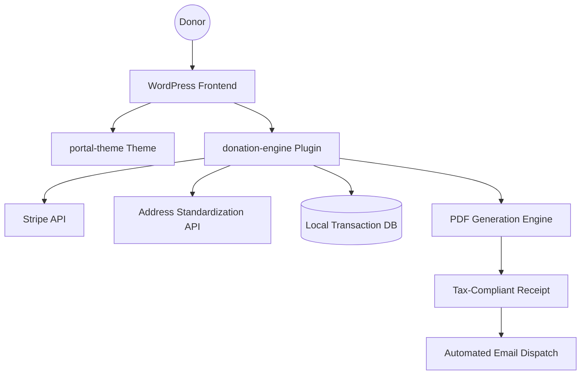

# Enterprise Donation Platform: Technical Architecture

This document provides a high-level overview of the technical architecture of the custom Donation Platform. The system is engineered to provide a high-performance, secure, and multi-currency experience for global philanthropy.

## System Components

The platform is built on two primary custom-developed layers:

1.  **Frontend & UI (Theme: `portal-theme`)**: A specialized WordPress theme providing a conversion-optimized donation interface and donor dashboard.
2.  **Financial Engine (Plugin: `donation-engine`)**: A secure, multi-currency transaction and fulfillment system.

---

## 1. High-Level Data Flow

---

## 2. Component Breakdown

### A. UI/UX Strategy (`portal-theme`)
The theme is optimized for frictionless giving:
*   **Donor Dashboard**: A centralized area for users to track their historical contributions and manage recurring support.
*   **Modular Layouts**: A component-based design system allowing for rapid deployment of new fundraising campaigns.
*   **Performance Optimization**: Minimalist CSS/JS footprint to ensure fast load times during high-traffic campaign periods.

### B. Financial Engine (`donation-engine`)
A proprietary financial module that handles the complexities of global philanthropy:
*   **Stateful Cart System**: Allows donors to combine multiple causes (e.g., Zakat, General Fund) into a single secure transaction.
*   **Multi-Currency Support**: Real-time currency conversion and localized payment processing.
*   **Secure Checkout**: Tokenized integration with Stripe for PCI-compliant handling.
*   **Automated Fulfillment**: On-the-fly PDF generation and intelligent notification routing.

---

## 3. Technology Stack

| Layer | Technology |
| :--- | :--- |
| **CMS** | WordPress (PHP 8.x) |
| **Frontend** | HTML5, CSS3, JavaScript (jQuery), Bootstrap 5 |
| **Financial API** | Stripe API, Secure Webhooks |
| **Infrastructure** | MySQL, Google Maps API (Geocoding) |
| **Document Engine** | Dompdf (PDF Generation) |

---

## 4. Security & Compliance
*   **Tokenized Payments**: Sensitive financial data is never stored locally; all transactions use secure tokens via third-party gateways.
*   **Standardized Data**: All donor information is validated and standardized via external APIs before database entry.
*   **Access Control**: Custom permission callbacks ensure that financial records are only accessible to authorized administrative roles.
